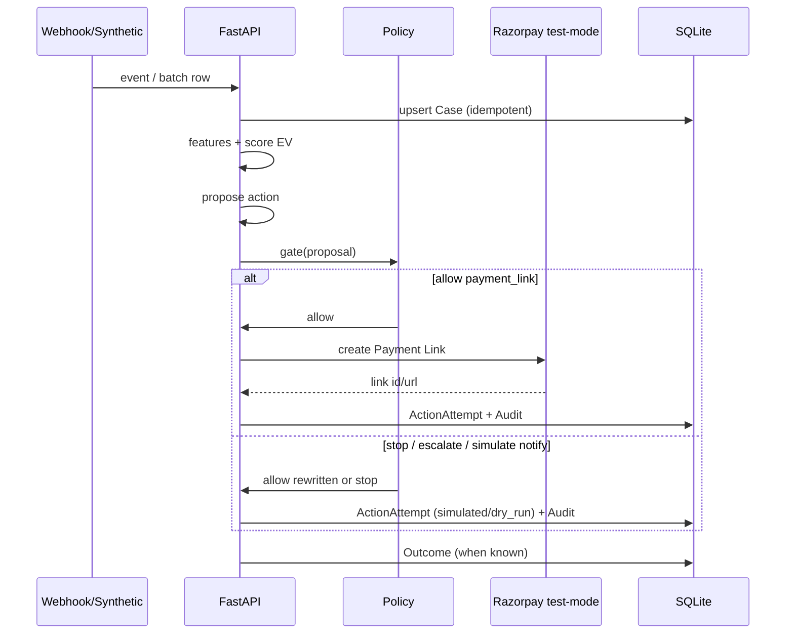

# System overview

> Rebound architecture — locked for MVP build start (22 Aug 2026).

## Context diagram

```text
┌─────────────┐     webhook / synthetic      ┌──────────────────┐
│  Razorpay   │ ───────────────────────────▶ │   Rebound API    │
│  test-mode  │ ◀── Payment Links / reads ── │    (FastAPI)     │
└─────────────┘                              └────────┬─────────┘
                                                      │
                 ┌────────────────────────────────────┼────────────────────────┐
                 │                                    ▼                        │
                 │  ingest → features → score → propose → policy → execute     │
                 │                         │                │                  │
                 │                         ▼                ▼                  │
                 │                      audit DB ←──────── outcomes            │
                 │                         │                                   │
                 │                         ▼                                   │
                 │                      eval runner                            │
                 └─────────────────────────────────────────────────────────────┘
                                                      │
                                                      ▼
                                              ┌───────────────┐
                                              │  Ops UI       │
                                              │  (React/TS)   │
                                              └───────────────┘
```

## Sequence — decide & act



## Safety architecture (non-negotiable)

```text
ML / rules / optional LLM
        ↓  structured proposal only
Deterministic policy engine
        ↓  allowlist + caps + stop rules
Executor (Razorpay client | simulator)
        ↓
Audit trail
```

The LLM never calls Razorpay directly.

## Package layout (Aug 23 target)

```text
src/
  apps/
    api/                 # FastAPI entry
    web/                 # React app
  rebound/
    ingest/
    features/
    scoring/
    propose/
    policy/
    execute/
    audit/
    eval/
    db/
    schemas/
  scripts/
    seed_batch.py
    run_eval.py
```

## Runtime config

| Var | Purpose |
| --- | --- |
| `RAZORPAY_KEY_ID` / `SECRET` | Test-mode |
| `RAZORPAY_WEBHOOK_SECRET` | Optional verify |
| `REBOUND_EXECUTION_MODE` | `dry_run` \| `test_mode` |
| `REBOUND_ENABLE_LLM_PROPOSER` | default `false` |
| `DATABASE_URL` | sqlite:///./rebound.db |

## Non-goals (architecture)

- Microservice mesh  
- Event bus / Kafka  
- Multi-region  
- Replacing Razorpay retry rails  
